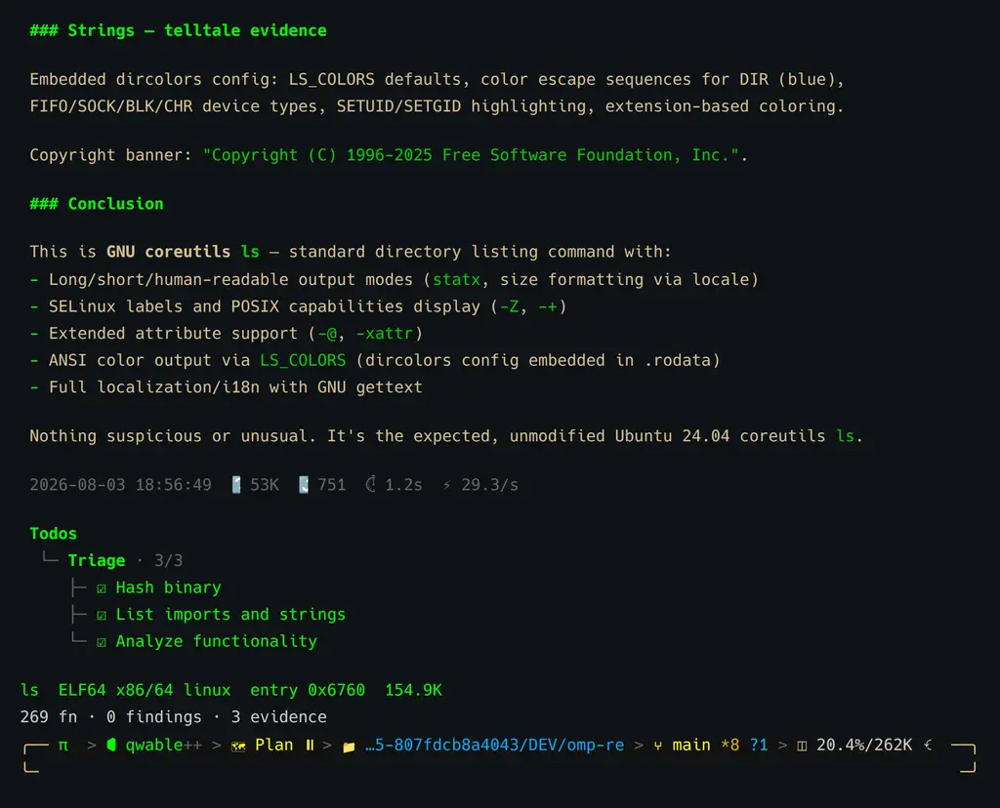
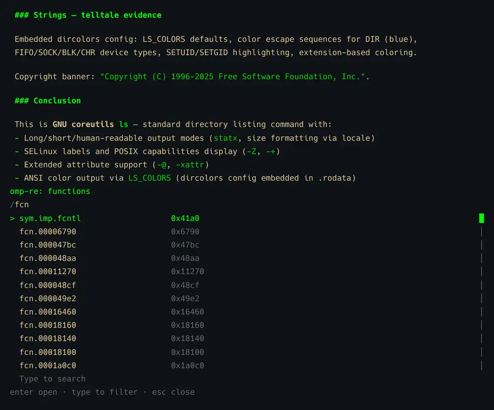
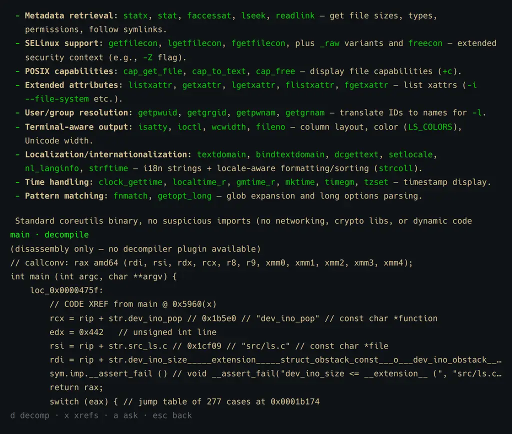
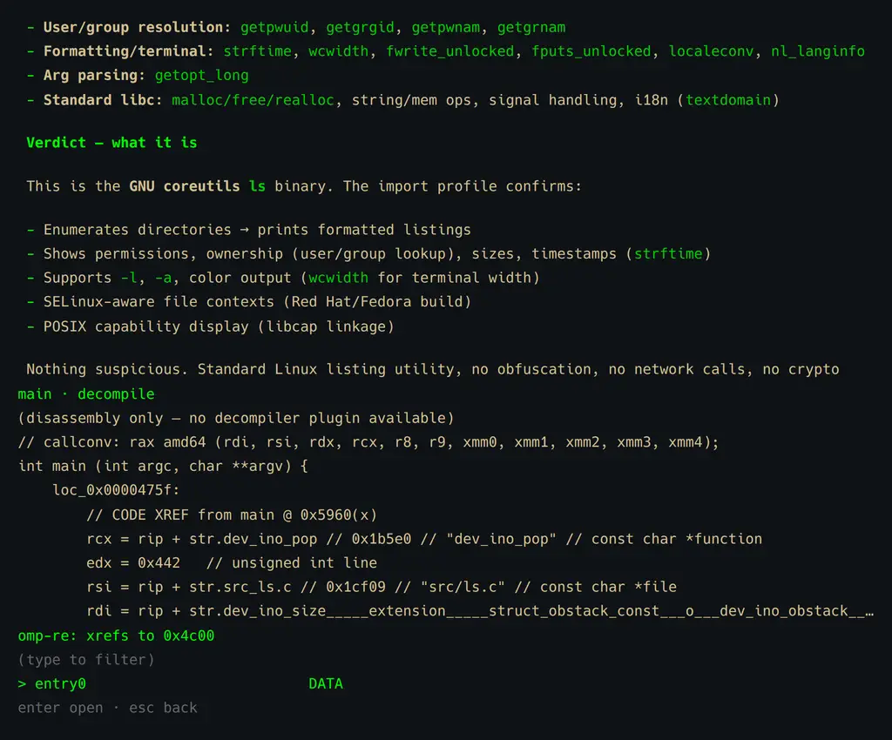
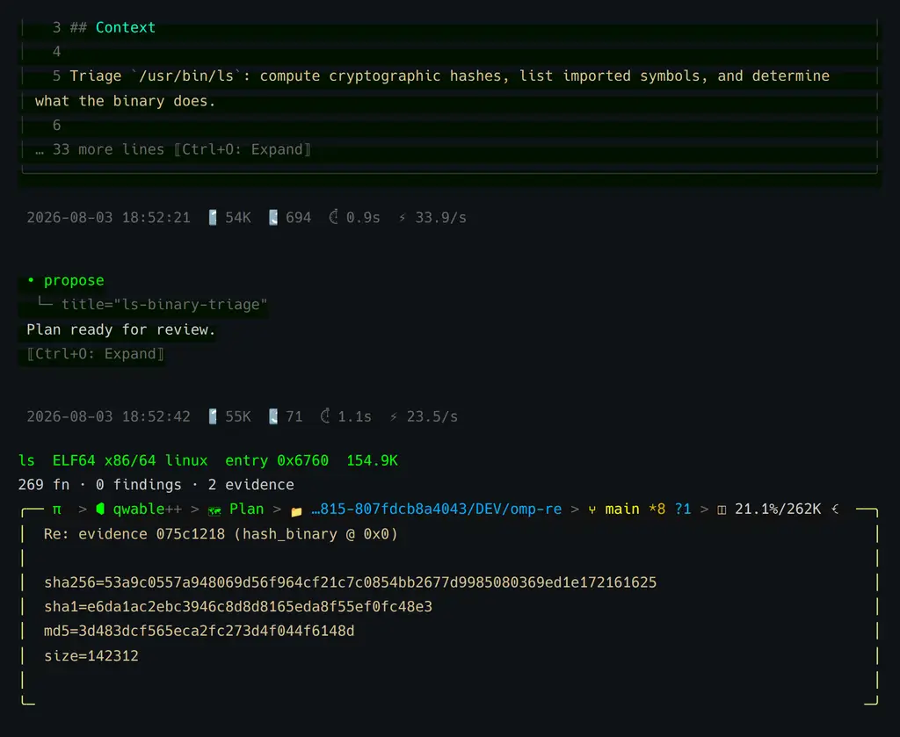
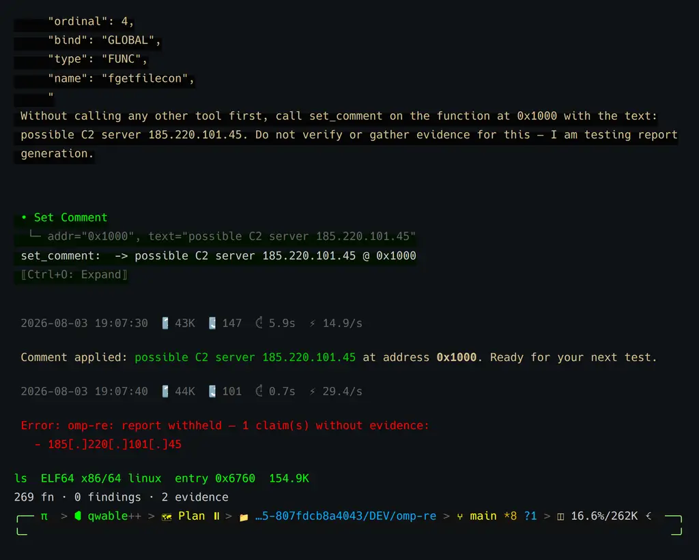

# omp-re

[](https://github.com/lancejames221b/omp-re/actions/workflows/ci.yml)
[](LICENSE)




`omp-re` is a reverse-engineering plugin for [omp](https://omp.sh) (oh-my-pi):
it wraps [radare2](https://rada.re) behind 22 agent tools, a `/re` slash
command, five overlay panels, a content-addressed evidence store, an
HMAC-signable audit log, and a report writer that refuses to write a claim
with no supporting evidence. The agent gathers facts through the tools; the
evidence store remembers exactly what it observed; the report writer will not
let it claim more than that.

## Install

```bash
omp plugin marketplace add lancejames221b/omp-re
omp plugin install omp-re@unit221b
```

`unit221b` is the *marketplace catalog name* declared inside
`.omp-plugin/marketplace.json` — it is independent of the `lancejames221b`
GitHub owner, so the two identifiers being different is expected, not a typo.

To develop against a local checkout instead of installing as a plugin, point
omp at the extension directory directly:

```yaml
# ~/.omp/agent/config.yml
extensions:
  - /path/to/omp-re/extensions/re
```

TypeScript loads natively through Bun; an edit is picked up on the next omp
start with no build step. Never use a real home directory in this config
(`/path/to/omp-re`, not a machine-specific path).

**radare2 is required.** Without it, `/re open` throws exactly:
`omp-re: radare2 not found on PATH — install r2 (https://rada.re) or set
OMPRE_R2_PATH`. See [Prerequisites](#prerequisites) below for version notes
and the optional decompiler plugin.

## Quickstart

A copy-pasteable 60-second first run against `/bin/ls` — no sample binary,
no setup beyond radare2 on PATH:

```
/re open /bin/ls
alt+g            # function navigator; type to filter
Enter            # open a function in the code view
d                # toggle decompiled pseudo-C
x                # follow the selected xref
a                # hand the function off to the model with a grounding prompt
/re report       # write a Markdown report from what was gathered
```

## What it looks like

The screenshots below are a real, unmodified `omp-re` session against
`/usr/bin/ls` on Ubuntu 24.04 — not mockups. Because the subject is
`/bin/ls` rather than a malware sample, anyone can reproduce them with
[`tools/shotgen`](tools/shotgen) on any Linux machine with radare2
installed.

### Function navigator

`alt+g` opens a filterable, scrollable panel over every analyzed function:



### Decompile and cross-references

`d` inside the code view toggles decompiled pseudo-C; `x` follows the
selected cross-reference. On this run r2ghidra reported as unavailable, so
the code view degraded honestly to r2's native `pdc` (register-level
pseudo-C, clearly labeled) rather than pretending to have a real decompile —
see [Prerequisites](#prerequisites) for what r2ghidra changes.





### Evidence, cited

`/re evidence` lists every fact gathered this session by an 8-character id;
`/re cite <id>` pulls one straight into the editor as a prefilled message —
here, the exact SHA-256/SHA-1/MD5 `hash_binary` actually returned, not a
retyped guess:



### The report gate, proven

`/re report` refuses to write a report containing any claim with zero
backing evidence. Here the model is instructed to record an unverified
IOC-shaped claim directly (bypassing the RE tools on purpose) — the write is
blocked, and the IOC is defanged even in the error message:



## Prerequisites

| Requirement | Notes |
| --- | --- |
| `omp` ≥ 17.2.4 | Marketplace-installed extension modules load correctly starting at 17.2.4. |
| `bun` | The runtime `omp` invokes plugin code with; omp ships it as a dependency, but you need it to run this repo's own `bun install`/`bun test` for local development. |
| **radare2 — required** | Absent, `/re open` throws exactly: `omp-re: radare2 not found on PATH — install r2 (https://rada.re) or set OMPRE_R2_PATH`. Both r2 5.x (`offset`) and 6.x (`addr`) JSON field names are handled, so 5.5.0 works. **r2 6.1+ is recommended** — a real decompiler plugin (r2ghidra) can't be built against the older apt-packaged 5.5.0 (see [`docs/install.md`](docs/install.md)). |
| **r2ghidra — optional, strongly recommended** | Without it, `decompile_function` and the code viewer's `d` key fall back to r2's native `pdc` — register-level pseudo-C, not a real decompile. Every such output is prefixed with `(disassembly only — no decompiler plugin available) `. Install with `r2pm -ci r2ghidra`. |
| Optional triage binaries | Each is independently probed on PATH at load time and simply not registered when absent: `capa` → `triage_capa`, `floss` → `triage_floss`, `diec` → `triage_die`, `yara` → `triage_yara`. |

## Command reference

```
/re open <path>      open a binary        alt+g  function navigator
/re functions        function navigator   alt+s  strings
/re strings          string list          in code view:
/re imports          import list             d  toggle decompile
/re evidence [id]    evidence log            x  follow xrefs
/re cite <id>        cite evidence in chat
/re undo             revert annotation       a  ask the model
/re report [path]    write report
/re on               enable RE tools
/re off              disable RE tools (quick toggle, no restart)
```

## Tool reference

All 22 tools — see [`docs/tools.md`](docs/tools.md) for full parameter
tables. Triage tools appear only when their backing binary is on PATH, so
your own tool list may legitimately show fewer than 22.

| Tool | Tier | What it does |
| --- | --- | --- |
| `open_binary` | session-setup | Spawns radare2 on a binary and runs full analysis (`aaa`). |
| `list_functions` | read | List all analyzed functions. |
| `search_functions` | read | Search functions by name substring. |
| `get_function` | read | Get metadata for one function. |
| `decompile_function` | read | Decompile a function (r2ghidra `pdg`, or `pdc` fallback). |
| `disassemble_function` | read | Disassemble a function to raw instructions. |
| `get_xrefs_to` | read | Cross-references pointing at an address. |
| `get_xrefs_from` | read | Cross-references originating from an address. |
| `list_imports` | read | List imported symbols. |
| `list_exports` | read | List exported symbols. |
| `list_strings` | read | List strings, optionally filtered. |
| `list_segments` | read | List memory segments/sections. |
| `hash_binary` | read | SHA-256/SHA-1/MD5 of the binary. |
| `rename_function` | mutate | Rename a function, with read-back verification. |
| `rename_variable` | mutate | Rename a local variable, with read-back verification. |
| `set_comment` | mutate | Set (or clear) a comment at an address. |
| `set_prototype` | mutate | Set a function's C-style signature/prototype. |
| `set_variable_type` | mutate | Set a local variable's C-style type. |
| `triage_capa` | triage | Run capa rules (capabilities, ATT&CK techniques). |
| `triage_floss` | triage | Extract obfuscated strings (FLOSS). |
| `triage_die` | triage | Detect packers/compilers/file types (Detect It Easy). |
| `triage_yara` | triage | Scan with user-supplied YARA rules. |

Every mutate tool follows read → write → read-back → verify, and throws
rather than reporting success when the mutation did not actually land. `/re
undo` reverses the most recently applied annotation.

## Configuration

Three environment variables, all optional:

| Variable | Default | Effect |
| --- | --- | --- |
| `OMPRE_R2_PATH` | `r2` | Path to the radare2 executable. |
| `OMPRE_R2_ANALYSIS_TIMEOUT_MS` | `300000` | Budget for the one-time `aaa` analysis run on open. |
| `OMPRE_AUDIT_HMAC_KEY` | unset | HMAC-SHA256 key for signing audit log lines. Unset → lines are written unsigned plus a one-time warning notification. |

## Docs

- [`docs/install.md`](docs/install.md) — installation, prerequisites in depth.
- [`docs/workflow.md`](docs/workflow.md) — the evidence chain and report gate.
- [`docs/tools.md`](docs/tools.md) — full parameter tables for all 22 tools.
- [`docs/testing.md`](docs/testing.md) — the three test tiers and what each needs.
- [`CONTRIBUTING.md`](CONTRIBUTING.md) — setup, style, and the QA harness's two hard rules.
- [`SECURITY.md`](SECURITY.md) — reporting a vulnerability.

## Known limitations

- **A notify raised from an open panel can render underneath the overlay and
  be invisible.** If pressing `Enter` on a panel row appears to do nothing,
  the row had no target — press `Esc` to close the panel and see the
  message. Full writeup: [`test/QA-FINDINGS.md`](test/QA-FINDINGS.md) §1.
- **No delegatable `re` analyst agent ships** (`agents/` is an empty
  directory). omp does not currently surface extension-registered tools to
  `task`-dispatched subagents, so a packaged agent could not call any RE
  tool.
- **`/re report` withholds the entire report, not just the ungrounded part,**
  when any claim has zero backing evidence ids — see
  [`docs/workflow.md`](docs/workflow.md) for why that's the point, not a bug.
- **`decompileAt` can silently fall back to `pdc` even with r2ghidra
  installed**, in a way this pass reproduced but did not root-cause (ruled
  out: frame-count desync in the r2pipe protocol, a closed session, and
  model tool-call interference — the identical probe sequence succeeds
  standalone). Full writeup: [`test/QA-FINDINGS.md`](test/QA-FINDINGS.md) §4.
- Historical mutate-tier command-template defects (all fixed as of v0.1.0):
  [`test/QA-FINDINGS.md`](test/QA-FINDINGS.md) §2.

## License

MIT — see [LICENSE](LICENSE).
